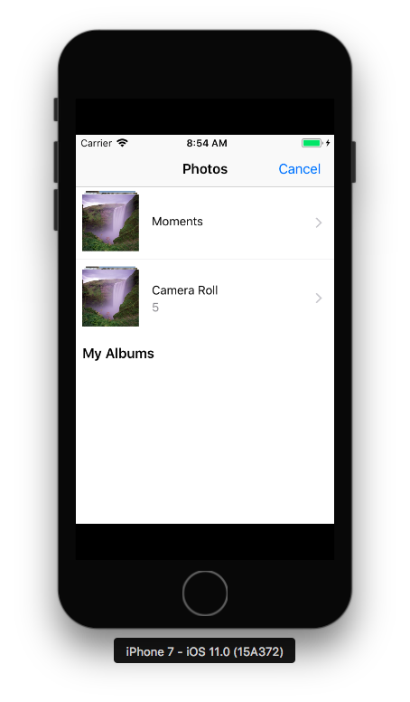
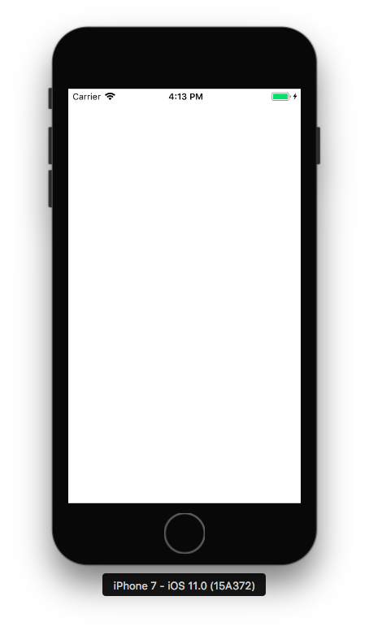

# 🏊🏻 Splash


[](https://dashboard.buddybuild.com/apps/59ed8ff243aa2a0001c0ba1c/build/latest?branch=master)

Test different app layouts with only one device.

<p align="center">



</p>

## Features
- Configuring Xcode project for different layouts

## Using

Run `splash` in a project directory and choose a layout. Don't forget to clean a project with `Cmd+Shift+K` to remove cached splash screens.

## Installing

### Homebrew (recommended):

```bash
$ brew install artemnovichkov/projects/splash
```

### Make:

```bash
$ git clone https://github.com/artemnovichkov/splash.git
$ cd splash
$ make
```

### Swift Package Manager:

```swift
// swift-tools-version:4.0

import PackageDescription

let package = Package(
    name: "Project",
    dependencies: [
    .package(url: "https://github.com/artemnovichkov/splash.git", from: "1.0.0"),
        ],
    targets: [
        .target(
            name: "Project", dependencies: ["splash"])
    ]
)
```

## TODOs:

 - [ ] A command for cleaning: removing added files, return Splash Screen path

## Author

Artem Novichkov, novichkoff93@gmail.com

## License

Splash is available under the MIT license. See the LICENSE file for more info.
